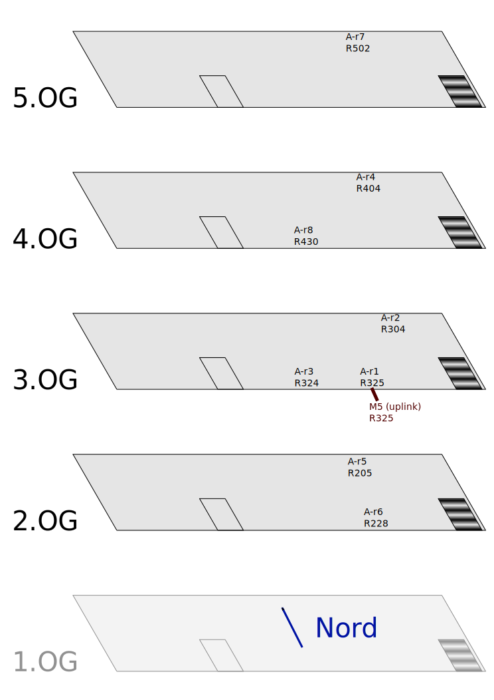

## Projektbeschreibung
* Freifunk für Flüchtlingsunterkunft in der Agnetenstraße
* 1 Gebäude 
* ca. 200 Bewohner
* Sprachen: arabisch, kurdisch, englisch

## Technik
* Knoten von TP-Link: agneten-refugee1 bis agneten-refugee4
* 2x Nanostation M5 XW

#verfügbare Hardware
Name | Macadresse | Modell|  Ort | SSH | M-VPN/MOL/MOW | public VPN-Key | GPS | Token | sonstiges
:-- |:-- |:-- |:-- |:-- |:-- |:-- |:-- |:-- |:--
[ofcourseistillloveyou](https://map.md.freifunk.net/#!v:m;n:44d9e724b1ac) |44:d9:e7:24:b1:ac |Nanostation M5  |3.OG r325  |ffmd-admin |nein/ja/nein | - | 52.14686,11.6449
[agneten-refugee1](https://map.md.freifunk.net/#!v:m;n:60e327604d1e) |60:e3:27:60:4d:1e | TL-841N v9 |3.OG r325 |ffmd-admin |nein/nein/nein |- | | |  ehemals alter-spielplatz 
[agneten-refugee2](https://map.md.freifunk.net/#!v:m;n:30b5c2d9b0ca) |30:b5:c2:d9:b0:ca | TL-841N v9 |3.OG r304|ffmd-admin |nein/nein/nein |- |52.146960, 11.644773  |  |  ehemals Kulturanker-11
[agneten-refugee3](https://map.md.freifunk.net/#!v:m;n:30b5c2d9ab64) |30:b5:c2:d9:ab:64 | TL-841N v9 |3.OG r324 |ffmd-admin |nein/nein/nein |- |52.146973, 11.644596  |  |  ehemals Kulturanker-12
[agneten-refugee4](https://map.md.freifunk.net/#!v:m;n:30b5c2d99822) |30:b5:c2:d9:98:22 | TL-841N v9 |4.OG r404 |ffmd-admin |nein/nein/nein |- |  |  |  ehemals Kulturanker-14
[agneten-refugee5](https://map.md.freifunk.net/#!v:g;n:30b5c2d997d8) |30:b5:c2:d9:97:d8 | TL-841N v9 | |ffmd-admin |nein/nein/nein |- |  |  |  ehemals Kulturanker-1
[agneten-refugee6](https://map.md.freifunk.net/#!v:g;n:30b5c2d997c2) |30:b5:c2:d9:97:c2 | TL-841N v9 | |ffmd-admin |nein/nein/nein |- |  |  |  ehemals Kulturanker-2
[agneten-refugee7](https://map.md.freifunk.net/#!v:g;n:30b5c2d9982a) |30:b5:c2:d9:98:2a | TL-841N v9 | |ffmd-admin |nein/nein/nein |- |  |  |  ehemals Kulturanker-3
[agneten-refugee8](https://map.md.freifunk.net/#!v:g;n:30b5c2d99706) |30:b5:c2:d9:97:06 | TL-841N v9 | |ffmd-admin |nein/nein/nein |- |  |  |  ehemals Kulturanker-4

#Bilder

