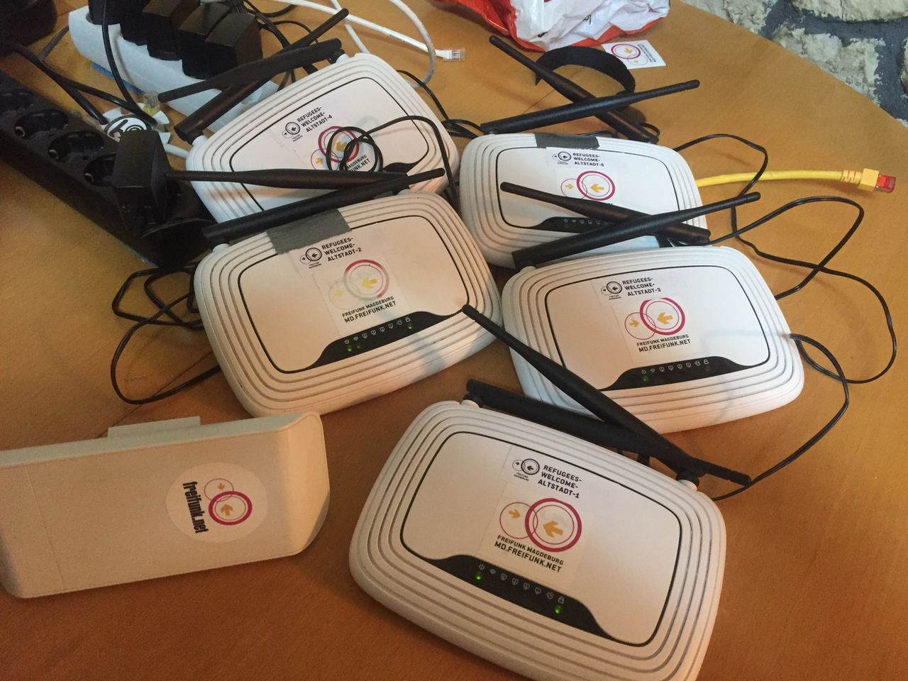
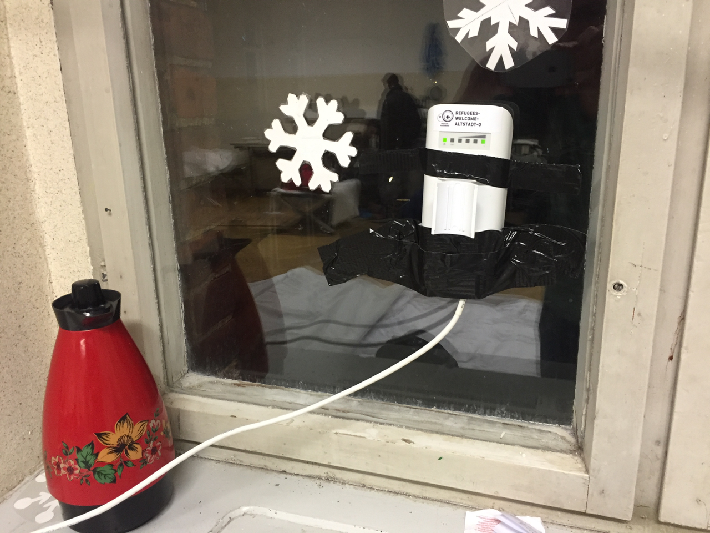
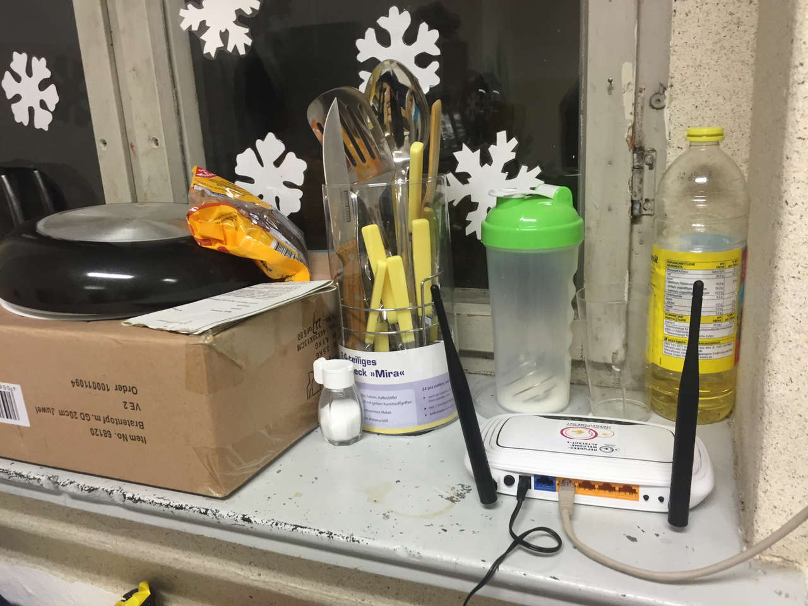
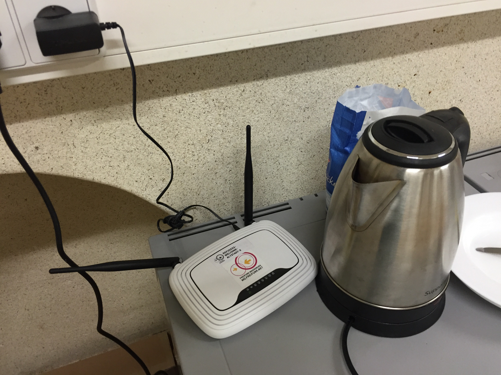
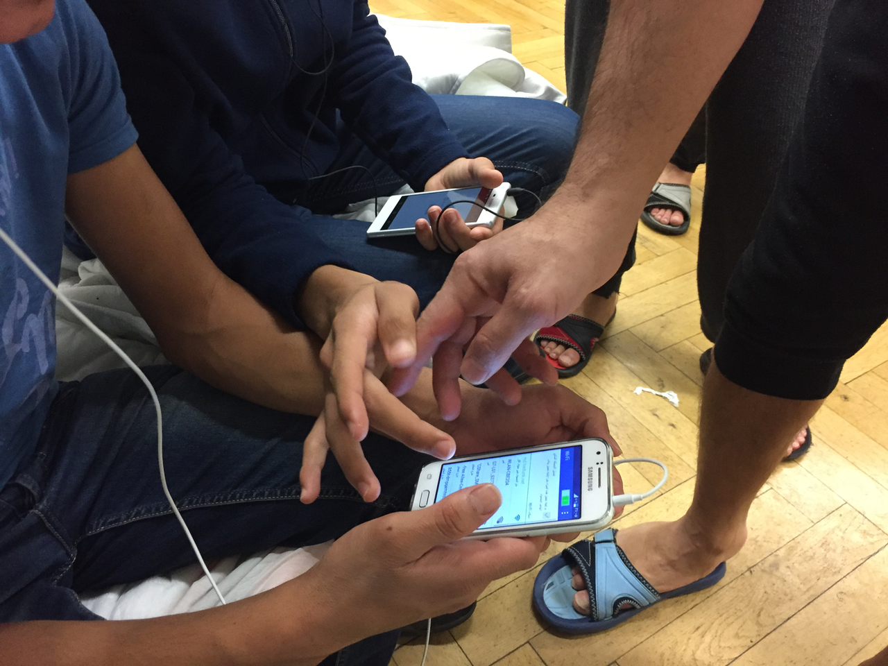

## Projektbeschreibung
* Freifunk für Flüchtlingsunterkunft in der kleinen Schulstraße / Altstadt
* 1 Gebäude 
* ca. 100 Bewohner
* Sprachen:arabisch, kurdisch, english

## Technik
* Knoten von TP-Link: brg-ref-1 bis brg-ref-20
* 2x Nanostation Loco M2
* Halterungen: 2x Nanobracket (für jeweils 1x NS Loco M2)

#verfügbare Hardware
Name | Macadresse | Modell|  Ort | SSH | M-VPN/MOL/MOW | public VPN-Key | GPS | Token | sonstiges
:-- |:-- |:-- |:-- |:-- |:-- |:-- |:-- |:-- |:--
ffmd-nslm2 |24:a4:3c:e4:c6:5f |NSM2 Loco | |ffmd-admin |nein/nein/nein | - | 52.134934927963 11.648141873169
Refugees-Welcome-Altstadt-0 |68:72:51:28:10:fb |NSM2 Loco |2.OG Raum 16 |ffmd-admin |nein/nein/nein |- | 52.136507, 11.649166 |  |  ehemals Kulturanker-outdoor-02
Refugees-Welcome-Altstadt-1 |30:b5:c2:d9:98:06 |TL841N v9.0 |2.OG Raum 16 |ffmd-admin |nein/ja/nein |- | 52.136557, 11.6490596 |  |  ehemals Kulturanker-15
Refugees-Welcome-Altstadt-2 |30:b5:c2:d9:ac:f2 |TL841N v9.0 |2.OG Raum 17 |ffmd-admin |nein/ja/nein |- | 52.136649, 11.649059 |  |  ehemals Kulturanker-16
Refugees-Welcome-Altstadt-3 |30:b5:c2:d9:97:92 |TL841N v9.0 |1. OG Raum 5 |ffmd-admin |nein/nein/nein |- | 52.136590, 11.649381 |  |  ehemals Kulturanker-18
Refugees-Welcome-Altstadt-4 |30:b5:c2:d9:98:68 |TL841N v9.0 |1. OG Raum 7 |ffmd-admin |nein/ja/nein |- | 52.136573, 11.649386 |  |  ehemals Kulturanker-19
Refugees-Welcome-Altstadt-5 |30:b5:c2:d9:97:e0 |TL841N v9.0 |2.OG Raum 15 |ffmd-admin |nein/ja/nein |- | 52.136488, 11.649365 |  |  ehemals Kulturanker-20

#Bilder

