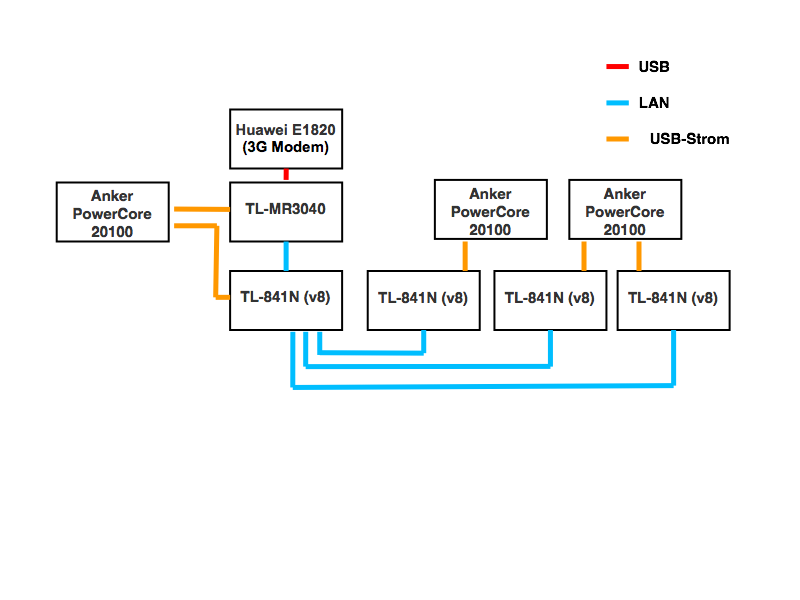

#Freifunk Balkan

##Projektbeschreibung
Aufbau eines Mobilen WLAN-Hotspot Datennetzwerkes für Vertriebene/Geflüchtete auf der "Balkanroute" bzw. Griechenland (Türkisch/Grieschische Grenze) mithilfe von Freifunk.

## Aufbau

* Uplink: Huawei E1820 (3G Modem) an einem TL-MR3040 (USB)
* LAN von TL-MR3040 zu einem TL-WR841N v8
* alle Geräte werden mittels USB-Akkus (Anker PowerCore) betrieben und sind somit mobil einsetzbar.
* Die Akkus werden z.B. an einem KZF geladen

##Software
* 4x TL-WR841N v8 mit Freifunk Magdeburg Firmware (Gluon)
* davon 1x Uplink Konten TL-WR841N v8 (Mesh VPN, Mesh-on-Lan)
* und 3x TL-WR841N (Mesh-on-WAN)

##Hardware
###Paket 1

Name | Anzahl | Preis einzeln | Preis gesamt
:-- |:-- |:-- |:--
[Anker PowerCore 20100mAh 2-Port 4.8A](http://de.ianker.com/product/A1271011) | 3 x | 30 € | 90 € 
[TL-MR3040](http://www.tp-link.de/products/details/?categoryid=&model=TL-MR3040) | 1 x | 58 € | 58 €
[Huawei E1820]() | 1 x| 30 € | 30 €
[DELOCK 82197USB > Hohlstecker Ø5,5/Ø2,1 - 5V - Länge 1,0m](https://www.reichelt.de/USB-Konverter/DELOCK-82197/3/index.html?&ACTION=3&LA=5000&GROUP=EU5&GROUPID=6908&ARTICLE=130988&START=0&SORT=artnr&OFFSET=16) | 4 x | 2 € | 8 €
[TL-WR841N v8](http://www.tp-link.de/products/details/?categoryid=238&model=TL-WR841N) | 4x | 16 € |  64 €
Gesamt | | | 250 €

###weitere Bestellungen
Name | Anzahl | Preis einzeln | Preis gesamt
:-- |:-- |:-- |:--
[DELOCK 82197USB > Hohlstecker Ø5,5/Ø2,1 - 5V - Länge 1,0m](https://www.reichelt.de/USB-Konverter/DELOCK-82197/3/index.html?) | 6 x | 2 € | 12 €
[DELOCK 83162 :: USB 2.0-A Stecker>USB micro-B](https://www.reichelt.de/USB-Kabel/DELOCK-83162/3/index.html?&ACTION=3&LA=5000&GROUP=EU4&GROUPID=6907&ARTICLE=127085&START=0&SORT=artnr&OFFSET=16) | 2 x | 2,10 € |4,10 €
[AK 673-A :: USB-Kabel 2.0,A-Stecker/Mini-B-USB-5P-St>1,5m](https://www.reichelt.de/USB-Kabel/AK-673-A/3/index.html?&ACTION=3&LA=5000&GROUP=EU4&GROUPID=6907&ARTICLE=45361&START=0&SORT=artnr&OFFSET=16) |2 x | 1,00€ | 2 €
[Huawei E5151]() | 1 x |  ca. 58 € | ca. 58 €
Gesamt | | | 76,1 €
